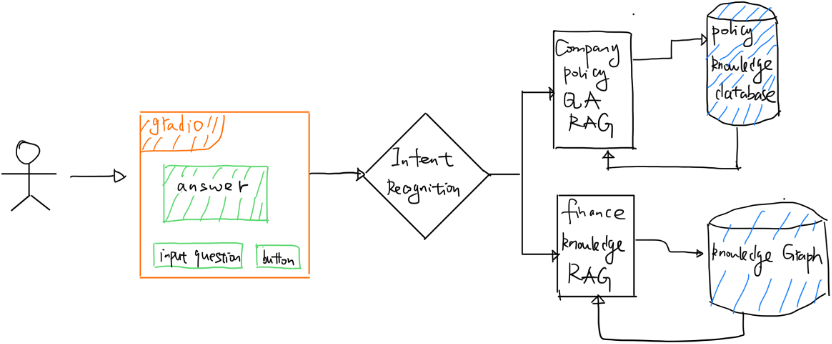

# Enterprise **Agentic** RAG Assistant (LLM)

An enterprise RAG-based QA system that integrates multi-format policy documents and financial knowledge graphs. Built with LangChain, HuggingFace embeddings, Chroma, and Neo4j, and deployed via Gradio UI. Features query transformation, multi-index retrieval, reranking, and iterative retrieval augmentation.

## 1. Web UI demonstration

The following figure shows the web UI of the project, implemented with **Gradio**.  

⚠️ Note: The current demo corpus is in **Chinese** since I have not yet found a suitable English corpus. Once I do, the UI will also support English.. For clarity, the Chinese UI elements have been translated into English in the screenshot below.  


**Project Structure：**




## 2. Run

### 2.1 Prepare corpus
- Chunk and embed the **company corpus** and the **graph-based financial corpus**, then save them into your vector database.  
- Use and run the provided notebooks:  
  - `policy-corpus-to-vec-db.ipynb`  
  - `kg-corpus-to-vec-db.ipynb`  

### 2.2 Project setup
- In the same path as `erag.py`, create a folder named `data` and link it to `corpus-chunk-emb/data`

### 2.3 Dependencies
Make sure the following services are installed and running:  
- **Chroma** on port `8000`  
- **Neo4j** on port `7687`  
- **Ollama**

### 2.4 LLM configuration
- The default LLM is `llama3.2:latest`
- You can replace it with any other LLM, but you must update the model name in `model.py`

### 2.5 how to run program

- Enter the path where `erag.py`, input 

``` shell
uvicorn erag:app --host 1270.0.0.1 --port 7680 --worker 1
```

- then open your browser and visit:  

```shell
http://127.0.0.1:7680/erag
```


**Now, you have start the program, you can chat and query in chatbot!**